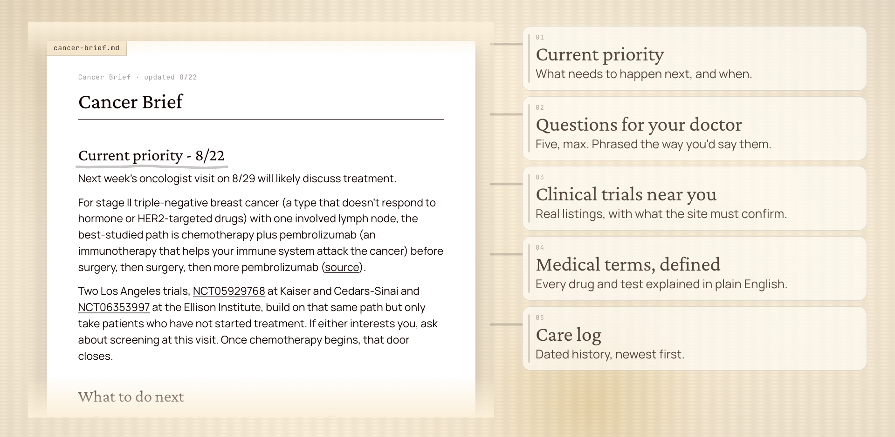

# Fuck Cancer

Create a practical brief to help patients and caregivers advocate for themselves: what to do next, the key facts, plain-English medical definitions, and relevant clinical trials.

https://github.com/user-attachments/assets/9fc8754f-ada3-474c-be65-d4c22f8a2262

## Problem

Since I published [my mom's cancer story](https://creatoreconomy.so/p/my-mom-survived-breast-cancer-three), I’ve heard from many people supporting a loved one through cancer. Cancer casts a dark cloud over the whole family.

The last thing a patient or caregiver needs is a pile of confusing medical terms, hype, and scattered information. They need clear answers to three questions: What should we do next? What are the key facts? What treatment options should we ask about?

## What this skill does



This skill creates and updates a source-of-truth brief for patients and caregivers to advocate for themselves. The brief gives you:

1. **Current priority.** What needs to happen next and when, so the family knows what to focus on.
2. **Questions for your doctor.** Five max, phrased the way you'd say them out loud.
3. **Clinical trials near you.** Real listings pulled live from the official ClinicalTrials.gov API, with what each site must confirm.
4. **Medical terms defined.** Every drug and test explained in plain English the first time it appears, so nobody has to leave the page to understand a sentence.
5. **Care log.** A dated history of visits and results, newest first.

The whole brief is one local Markdown file: no account, no database, no API key.

## How to install /fuck-cancer

The easiest way to install the skill is to paste this into ChatGPT, Claude Code, or your favorite agent:

```text
Install the /fuck-cancer skill globally from https://github.com/petergyang/fuck-cancer
```

You can also install it with `npx`:

```sh
npx skills add petergyang/fuck-cancer --skill fuck-cancer --global --yes
```

## How to use /fuck-cancer

Start with a brain dump:

```text
/fuck-cancer My dad was just diagnosed. Here’s what I know.
```

Paste or upload a report:

```text
/fuck-cancer Explain this report and help me prepare for Friday.
```

Research trials or second opinions:

```text
/fuck-cancer Find relevant trials near Toronto for this diagnosis.
```

Share new information as it arrives:

```text
/fuck-cancer Update our brief with this new biomarker report.
```

## Trusted medical sources

The skill grounds its research in trusted medical sources:

1. **Evidence and treatment context:** [NCI's PDQ summaries](https://www.cancer.gov/publications/pdq/information-summaries) or the official cancer agency for the patient's country.
2. **Drug approvals and labels:** The patient's national regulator, such as the FDA, Health Canada, EMA, MHRA, or TGA.
3. **Testing and clinical guidance:** Current official publications from groups such as ASCO, ESMO, CAP, or NICE when they directly apply.
4. **Clinical trials:** The official [ClinicalTrials.gov API](https://clinicaltrials.gov/data-api/api), including the status of the individual site.
5. **Medical definitions:** The [NCI Dictionary of Cancer Terms](https://www.cancer.gov/publications/dictionaries/cancer-terms/) or an equivalent official national source.
6. **Emerging questions:** Peer-reviewed primary research indexed in PubMed, with early or indirect evidence labeled as such.

## Disclaimer

The skill supports decisions with current evidence. It does not diagnose cancer, choose treatment, determine trial eligibility, or replace the patient's medical team.

## What's inside

1. [`SKILL.md`](skills/fuck-cancer/SKILL.md) contains the complete care-navigation and research workflow.
2. [`search_trials.py`](skills/fuck-cancer/scripts/search_trials.py) searches ClinicalTrials.gov API v2, filters sites by distance from home with `--near LAT,LON`, labels each site's recruitment status, and ranks likely matches first.
3. [`test_search_trials.py`](tests/test_search_trials.py) covers location normalization, distance filtering, site-status handling, pagination, criteria previews, and relevance ordering.
4. [`openai.yaml`](skills/fuck-cancer/agents/openai.yaml) contains the Codex skill metadata.

The skill does not require an account, database, or API key. The trial-search helper uses only Python's standard library and requires Python 3.8 or newer.

## License

MIT
